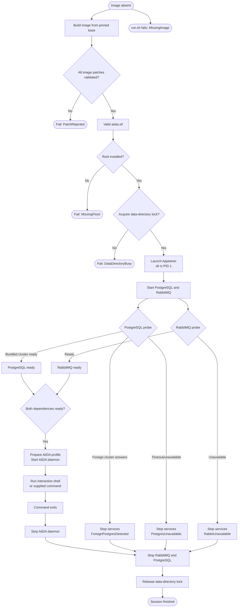
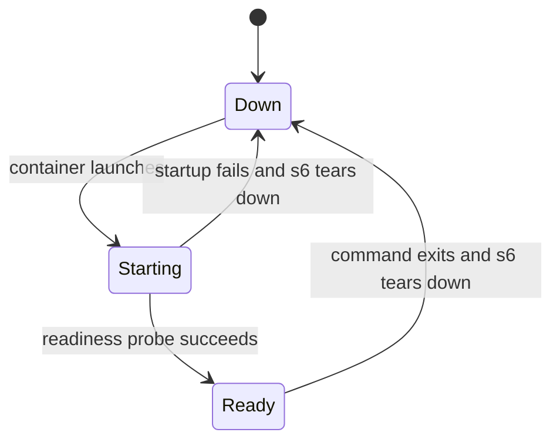

# AiiDA container lifecycle

This directory models the observable lifecycle defined by:

- [`containerfiles/aiida.def`](../../containerfiles/aiida.def): builds and
  patches the image.
- [`run.sh`](../../run.sh): validates the runtime, locks the persistent
  data directory, and starts the foreground Apptainer session.

The model is in [`./aiida_container.qnt`](aiida_container.qnt), with reachability
checks in [`./aiida_container_test.qnt`](aiida_container_test.qnt).

## End-to-end flow



PostgreSQL and RabbitMQ may become ready in either order. AiiDA cannot start
until both are ready and the PostgreSQL probe confirms that the server uses
the container's own data directory.

## Runtime service states



The three modeled services are PostgreSQL, RabbitMQ, and the AiiDA daemon.
The AiiDA transition to `Starting` is guarded by both dependency services
being `Ready`.

## Safety properties

The simulations check that:

1. AiiDA is never starting or ready unless PostgreSQL and RabbitMQ are ready.
2. AiiDA only uses the bundled PostgreSQL cluster, never a foreign server
   answering on the configured host port.
3. Running services always hold the exclusive persistent-data lock.
4. A foreign PostgreSQL server prevents profile creation.
5. A finished session has stopped all services and released the lock.

## Run the model

From this directory:

```console
quint typecheck aiida_container_test.qnt
quint run aiida_container_test.qnt \
  --main aiida_container_test \
  --invariants aiidaRequiresReadyDependencies profileUsesBundledServices \
    servicesRequireDataLock foreignPostgresIsRefused finishedSessionIsClean \
  --witnesses aiidaBecameReady successfulShutdownFinished \
    failedServiceStartupWasCleanedUp \
  --max-steps 18
```

The model intentionally abstracts concrete ports, polling duration, shell
commands, s6 implementation details, and AiiDA/RabbitMQ/PostgreSQL protocol
traffic. It models lifecycle ordering and data-safety decisions instead.
