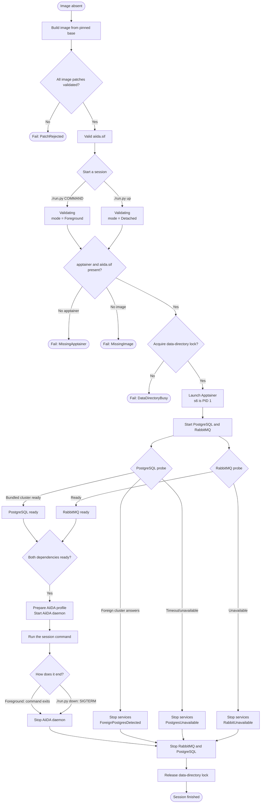
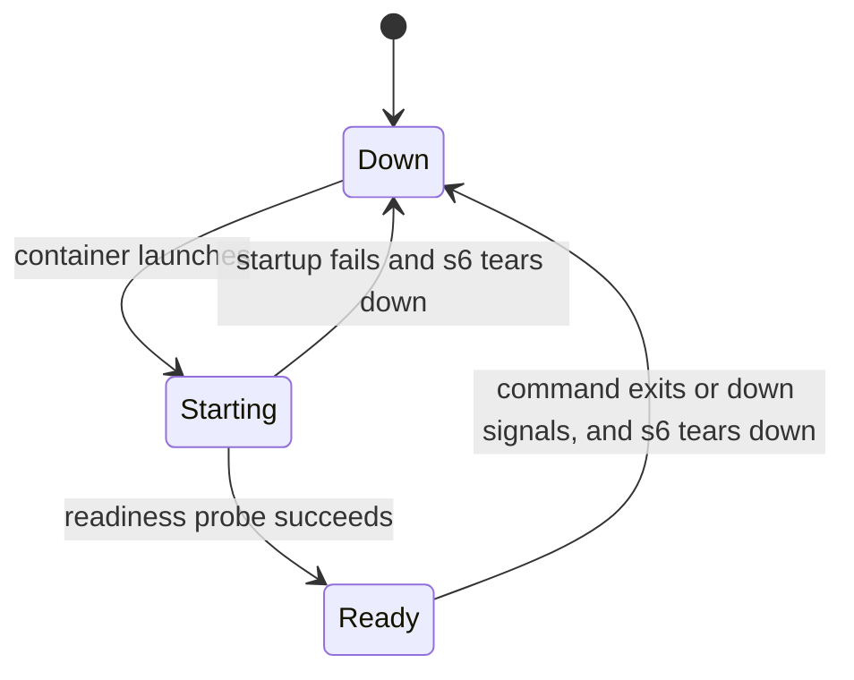

# AiiDA container lifecycle

This directory models the observable lifecycle defined by:

- [`containerfiles/aiida.def`](../../containerfiles/aiida.def): builds and
  patches the image.
- [`run.py`](../../run.py): validates the runtime, locks the persistent
  data directory, starts the Apptainer session in either mode, attaches
  shells to it, and stops it.

The model is in [`./aiida_container.qnt`](aiida_container.qnt), with reachability
checks in [`./aiida_container_test.qnt`](aiida_container_test.qnt).

## Sessions and attached shells

`run.py` starts one *session* — the `apptainer run` container where s6 is PID 1
and the services live — in one of two modes:

- **foreground** (`./run.py [COMMAND]`): the command returns on its own, and
  s6 tears the services down behind it;
- **detached** (`./run.py up`): the command is `sleep infinity`, so the session
  ends only when `./run.py down` signals it.

`./run.py attach` is not part of that session. It is a second container started
with `apptainer exec`, which skips the runscript: no s6, no services, and no
data-directory lock. That is why any number of attached shells can coexist with
one session without breaking `servicesRequireDataLock`, and why an attached
shell can outlive the session it was talking to.

## End-to-end flow



PostgreSQL and RabbitMQ may become ready in either order. AiiDA cannot start
until both are ready and the PostgreSQL probe confirms that the server uses
the container's own data directory.

Attached shells are deliberately off this path: `attachShell` needs nothing but
a session holding the lock — not even ready services — and `detachShell` may
fire at any point, including after the session has finished.

## Runtime service states



The three modeled services are PostgreSQL, RabbitMQ, and the AiiDA daemon.
The AiiDA transition to `Starting` is guarded by both dependency services
being `Ready`.

## Safety properties

The simulations check that:

1. AiiDA is never starting or ready unless PostgreSQL and RabbitMQ are ready.
2. AiiDA only uses the bundled PostgreSQL cluster, never a foreign server
   answering on the configured host port.
3. Running services always hold the exclusive persistent-data lock — attaching
   a shell must therefore never bring a service with it.
4. A foreign PostgreSQL server prevents profile creation.
5. A finished session has stopped all services and released the lock.
6. An attached shell only exists because a session started.
7. Only a foreground session's command returns by itself; a detached one ends
   on a signal.
8. Every shutdown has a cause: the command returned, `down` asked for it, or a
   service failed to come up.

## Run the model

From this directory:

```console
quint typecheck aiida_container_test.qnt
quint run aiida_container_test.qnt \
  --main aiida_container_test \
  --invariants aiidaRequiresReadyDependencies profileUsesBundledServices \
    servicesRequireDataLock foreignPostgresIsRefused finishedSessionIsClean \
    attachedShellsBelongToASession detachedCommandNeverReturns \
    shutdownHasACause \
  --witnesses aiidaBecameReady successfulShutdownFinished \
    detachedSessionStopped attachedShellRan severalShellsAttached \
    attachedShellOutlivedSession failedServiceStartupWasCleanedUp \
  --max-steps 24
```

The model intentionally abstracts concrete ports, polling duration, host
commands, s6 implementation details, and AiiDA/RabbitMQ/PostgreSQL protocol
traffic. It models lifecycle ordering and data-safety decisions instead. It
also leaves out `attach` and `down` refusing to run when no session holds the
lock: both are host-side diagnostics that change nothing the model tracks.
